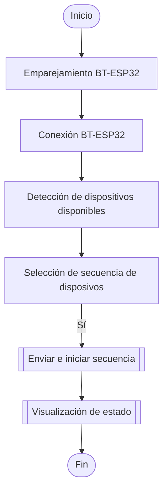

# Sequential ESP-NOW + BT-App

Sistema embebido modular que permite la activación secuencial de cada módulo mediante una app

# Descripción del proyecto

---

El proyecto consiste en un sistema embebido conformado por varias placas de desarrollo ESP32 que a través de una app permite monitorear constantemente el estado de cada una de ellas y realizar secuencias de activación. El sistema está trabajando mediante el protocolo ESP-NOW. Este permite la rápida comunicación entre varios dispositivos (máximo 20) y un rango de 50 metros aprox. (dependiendo el módulo y las interferencias que pueda haber. En el firmware se puede agregar un subprograma que puede contener lectura de diferentes sensores y un proceso antes de pasar al siguiente módulo de la secuencia.

## Comenzando ****🚀****

---

El trabajo se realizó mediante la placa de desarrollo ESP32 programada en lenguaje C++ utilizando el IDE de Arduino. Para poder subir el programa a la placa de desarrollo, este repositorio cuenta con 3 archivos:

- Sequential_ESP32-Mesh.ino
- Settings.h
- ESP32.apk

Estos tres se deben colocar en la plataforma para poder realizar la simulación}

## Diagrama de flujo

---

### ESP-NOW

Para la conexión entre dispositivos se utilizó el siguiente programa de referencia:

[Programa de referencia](https://github.com/techiesms/ESPNOW-Many-to-Many-Communication/blob/main/ESPNOW_Many2Many/ESPNOW_Many2Many.ino)

Bluetooth

## Componentes electrónicos principales

---

- ESP32
- Sensor VL53L1X
- 12 RGB LEDS
- Puerto tipo C
- Batería de Litio
- Buzzer
- Otros componentes

## Pruebas independientes

---

## Esquemático

---

## App

---

Se trabajó en Kodular

## Mejoras a futuro

---

### Funcionalidades

1. 

<aside>
💡

</aside>